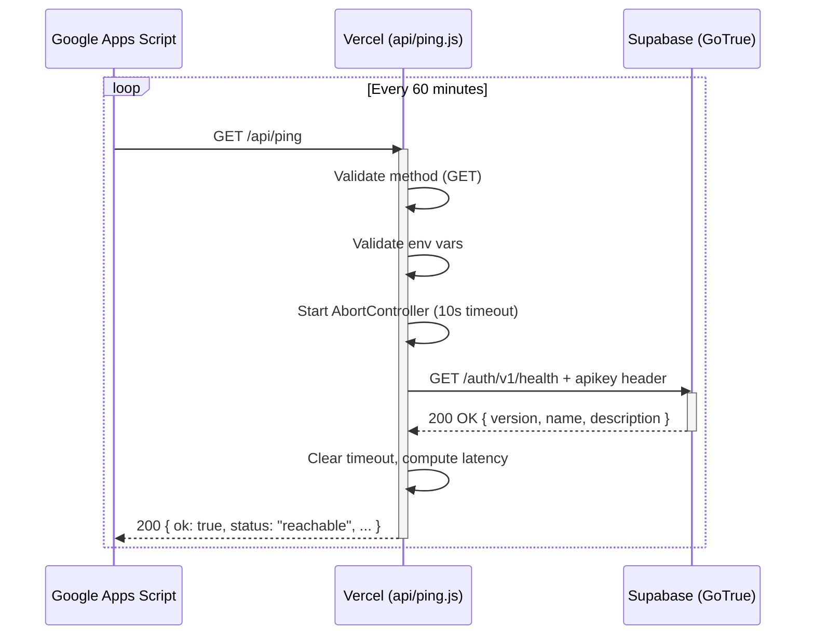

# PING_IMPLEMENTATION.md — Version de référence v1.0

Document officiel définissant l'architecture et l'implémentation de la route `/api/ping` pour le maintien en activité (KeepAlive) des projets Supabase sur plan gratuit.

---

## 1. Contexte

### Problème

Le plan gratuit Supabase met automatiquement en pause les projets après **1 semaine d'inactivité**. Aucune requête n'est alors possible tant que le projet n'est pas relancé manuellement depuis le dashboard Supabase.

Ce comportement est documenté dans le code source de Supabase :

```
free_tier: { value: '1', unit: 'week' }
```

L'inactivité est définie comme l'absence de toute requête HTTP atteignant l'infrastructure Supabase.

### Solution

Une **Serverless Function Vercel** exposée à l'URL `/api/ping` est appelée périodiquement (toutes les heures) par un service **Google Apps Script**.

Cette fonction effectue une requête HTTP légère vers l'endpoint officiel de santé de Supabase (`/auth/v1/health`), ce qui :

- empêche le compteur d'inactivité d'atteindre 1 semaine
- réveille le projet s'il est déjà en pause
- ne consomme quasiment aucune ressource

### Périmètre

| Élément | Concerné |
|---|---|
| Frontend (pages, composants) | ❌ Aucune modification |
| Backend Supabase (tables, fonctions) | ❌ Aucune modification |
| Code existant du projet | ❌ Aucune modification |
| Nouveau fichier créé | ✅ `api/ping.js` |
| Variables d'environnement | ✅ Aucune nouvelle variable (utilise les existantes) |

---

## 2. Architecture générale

### Flux

```
 Google Apps Script
     │
     │  GET https://domain.com/api/ping
     ▼
 ┌─────────────────────────────────────────┐
 │           Vercel Infrastructure          │
 │                                          │
 │  ┌──────────────────────────────────┐   │
 │  │   api/ping.js                    │   │
 │  │   Serverless Function            │   │
 │  │                                  │   │
 │  │   Validation :                   │   │
 │  │   • Méthode HTTP (GET)           │   │
 │  │   • Variables d'environnement    │   │
 │  │   • Timeout (AbortController)    │   │
 │  └──────────┬───────────────────────┘   │
 │             │                            │
 └─────────────┼────────────────────────────┘
               │
               │  GET /auth/v1/health
               │  + apikey header
               ▼
 ┌─────────────────────────────────────────┐
 │           Supabase Infrastructure        │
 │                                          │
 │  Kong API Gateway ──► GoTrue (Auth)     │
 │                                          │
 │  Réponse :                               │
 │  • 200 + { version, name, description }  │
 │  • 540 (project paused, en reprise)      │
 └──────────────────────────────────────────┘
```

### Diagramme Mermaid



---

## 3. Decisions d'architecture (ADR)

### ADR-1 : Serverless Function Vercel plutôt que Next.js API Route

| | Choix retenu | Alternative rejetée |
|---|---|---|
| **Solution** | Fichier dans `/api/ping.js` | Next.js API Route (`pages/api/ping.ts`) |
| **Raison** | Le projet existant est une Vanilla JS SPA, pas Next.js. Une Serverless Function Vercel ne nécessite aucun framework. | Aurait imposé une migration vers Next.js et l'ajout de dépendances lourdes. |
| **Compatibilité** | Fonctionne sur tout projet Vercel, quel que soit le framework. | Ne fonctionne que sur les projets Next.js. |

### ADR-2 : Endpoint `/auth/v1/health` plutôt qu'une table REST

| | Choix retenu | Alternative rejetée |
|---|---|---|
| **Solution** | `{SUPABASE_URL}/auth/v1/health` | `{SUPABASE_URL}/rest/v1/settings?select=key&limit=1` |
| **Raison** | Endpoint officiel de santé de GoTrue (Auth). Aucune dépendance de table, de schéma ou de RLS. Documenté dans le code source GoTrue comme *health check*. | Dépendait de l'existence de la table `settings`, des politiques RLS et du schéma du projet. Fragile et non portable. |
| **Source** | [Code GoTrue](https://github.com/supabase/auth) : `r.Get("/health", api.HealthCheck)` — sans middleware d'authentification. | — |

### ADR-3 : Aucune dépendance npm

| | Choix retenu | Alternative rejetée |
|---|---|---|
| **Solution** | Utilisation de `fetch()` natif (Node.js 18+) | Installation de `@supabase/supabase-js` ou `node-fetch` |
| **Raison** | `fetch()` est natif dans Node.js 18+, le runtime par défaut de Vercel. Zéro dépendance = zéro surface d'attaque, zéro maintenance, zéro build. | Aurait ajouté une dépendance inutile, augmenté le cold start et complexifié la maintenance. |

### ADR-4 : Aucune modification du frontend

| | Choix retenu | Alternative rejetée |
|---|---|---|
| **Solution** | Fichier totalement indépendant dans `/api/` | Modification de `js/supabase.js` ou ajout d'un appel dans le frontend |
| **Raison** | Séparation stricte des responsabilités. Le KeepAlive est une infrastructure, pas une fonctionnalité métier. | Aurait mélangé logique serveur et client, exposé la logique KeepAlive au navigateur, et violé le principe de responsabilité unique. |

### ADR-5 : Aucune migration SQL ni fonction RPC

| | Choix retenu | Alternative rejetée |
|---|---|---|
| **Solution** | Utilisation de l'endpoint HTTP `/auth/v1/health` | Création d'une fonction SQL `SELECT 1 AS ping` appelée via `/rest/v1/rpc/ping` |
| **Raison** | L'endpoint health est disponible immédiatement, sans aucune configuration préalable. Aucune modification de la base de données. | Aurait nécessité une migration SQL sur chaque projet, ajoutant une dépendance de schéma et une opération manuelle. |

### ADR-6 : Aucune utilisation de `SUPABASE_SERVICE_KEY`

| | Choix retenu | Alternative rejetée |
|---|---|---|
| **Solution** | Utilisation de `SUPABASE_ANON_KEY` uniquement | Utilisation de `SUPABASE_SERVICE_KEY` (service role) |
| **Raison** | L'endpoint `/auth/v1/health` est public (aucune authentification requise côté GoTrue). L'anon key est suffisante et déjà présente dans les variables d'environnement. | La clé service role est un secret critique (bypass RLS). L'utiliser pour un simple health check serait une violation du principe de moindre privilège. |

---

## 4. Fonctionnement détaillé

### Cycle complet d'une requête

```
1. RÉCEPTION
   └─ Vercel reçoit la requête HTTP et route vers api/ping.js
   └─ Le handler est appelé avec (req, res)

2. VALIDATION MÉTHODE HTTP
   └─ Si req.method !== 'GET'
       └─ Retour : 405 Method Not Allowed
       └─ Header : Allow: GET
       └─ Log : warn "Rejected {method}"

3. VALIDATION VARIABLES D'ENVIRONNEMENT
   └─ Vérifier SUPABASE_URL et SUPABASE_ANON_KEY
   └─ Si l'un est absent
       └─ Retour : 500 Internal Server Error
       └─ Log : error "Missing SUPABASE_URL or SUPABASE_ANON_KEY"

4. CRÉATION DU TIMEOUT
   └─ Nouvel AbortController
   └─ setTimeout(10s) → controller.abort()
   └─ Le timeout protège contre les appels bloquants

5. APPEL À SUPABASE
   └─ fetch(`${SUPABASE_URL}/auth/v1/health`)
   └─ Headers : Content-Type: application/json, apikey: ANON_KEY
   └─ Signal : controller.signal (pour l'annulation)

6. RÉCEPTION DE LA RÉPONSE
   └─ Annuler le timeout : clearTimeout(timeoutId)
   └─ Calculer la latence : Date.now() - start
   └─ Si response.ok (HTTP 2xx)
       └─ Retour : 200 { ok: true, status: "reachable", ... }
       └─ Log : log "Completed — {status} in {latency}ms"
   └─ Sinon
       └─ Retour : 503 { ok: false, status: "unreachable", ... }
       └─ Log : warn "Failed — HTTP {status} in {latency}ms"

7. GESTION DES ERREURS
   └─ AbortError (timeout dépassé)
       └─ Retour : 503 { ok: false, status: "timeout", ... }
       └─ Log : warn "Timeout — {timeout}ms exceeded"
   └─ Autre erreur (réseau, DNS, etc.)
       └─ Retour : 503 { ok: false, status: "unreachable", ... }
       └─ Log : error "{message} in {latency}ms"

8. RÉPONSE JSON
   └─ Headers ajoutés automatiquement :
       Cache-Control: no-store
       Pragma: no-cache
   └─ Corps JSON standardisé (voir section 5)
```

### Diagramme Mermaid

```mermaid
flowchart TD
    A[Requête entrante] --> B{Méthode GET ?}
    B -->|Non| C[405 + Allow header + log warn]
    B -->|Oui| D{SUPABASE_URL\net ANON_KEY\nprésents ?}
    D -->|Non| E[500 + message + log error]
    D -->|Oui| F[Créer AbortController 10s]
    F --> G[fetch /auth/v1/health\n+ apikey header]
    G --> H{Réponse reçue ?}
    H -->|Oui - Ok| I[clearTimeout + calcul latency]
    I --> J[200 + status reachable + log]
    H -->|Oui - Erreur HTTP| K[clearTimeout + calcul latency]
    K --> L[503 + status unreachable + log warn]
    H -->|Timeout (AbortError)| M[calcul latency]
    M --> N[503 + status timeout + log warn]
    H -->|Erreur réseau| O[calcul latency]
    O --> P[503 + status unreachable + log error]
```

---

## 5. API publique

### Endpoint

```
GET /api/ping
```

**Headers requis :** Aucun (la fonction ne lit pas les headers de la requête entrante).

**Headers de réponse :**

| Header | Valeur | Raison |
|---|---|---|
| `Cache-Control` | `no-store` | Interdire toute mise en cache |
| `Pragma` | `no-cache` | Compatibilité HTTP/1.0 |
| `Allow` | `GET` | Uniquement en cas de méthode non autorisée (405) |

### Réponses

#### 200 OK — Supabase joignable

```json
{
  "ok": true,
  "service": "supabase",
  "status": "reachable",
  "httpStatus": 200,
  "latency": 18,
  "timestamp": "2026-06-26T12:00:00.000Z",
  "project": "folqcezpofcchcnfzuwg"
}
```

| Champ | Type | Description |
|---|---|---|
| `ok` | boolean | `true` si le ping a réussi |
| `service` | string | Toujours `"supabase"` |
| `status` | string | `"reachable"` |
| `httpStatus` | number | Code HTTP retourné par Supabase (200) |
| `latency` | number | Temps de réponse en millisecondes |
| `timestamp` | string | Horodatage ISO 8601 de la réponse |
| `project` | string | Référence du projet Supabase (extrait de l'URL) |

#### 405 Method Not Allowed — Méthode incorrecte

```json
{
  "ok": false,
  "service": "supabase",
  "status": "unreachable",
  "httpStatus": 405,
  "latency": 0,
  "timestamp": "2026-06-26T12:00:00.000Z",
  "error": "Method POST not allowed"
}
```

**Header additionnel :** `Allow: GET`

#### 500 Internal Server Error — Configuration manquante

```json
{
  "ok": false,
  "service": "supabase",
  "status": "unreachable",
  "httpStatus": 500,
  "latency": 0,
  "timestamp": "2026-06-26T12:00:00.000Z",
  "error": "Missing SUPABASE_URL or SUPABASE_ANON_KEY environment variables"
}
```

#### 503 Service Unavailable — Supabase injoignable

```json
{
  "ok": false,
  "service": "supabase",
  "status": "unreachable",
  "httpStatus": 503,
  "latency": 250,
  "timestamp": "2026-06-26T12:00:00.000Z",
  "error": "Supabase returned HTTP 540"
}
```

#### 503 Service Unavailable — Timeout

```json
{
  "ok": false,
  "service": "supabase",
  "status": "timeout",
  "httpStatus": 503,
  "latency": 10000,
  "timestamp": "2026-06-26T12:00:00.000Z",
  "error": "Request timed out after 10000ms"
}
```

---

## 6. Variables d'environnement

| Nom | Obligatoire | Description | Exemple |
|---|---|---|---|
| `SUPABASE_URL` | ✅ Oui | URL complète du projet Supabase (sans chemin) | `https://folqcezpofcchcnfzuwg.supabase.co` |
| `SUPABASE_ANON_KEY` | ✅ Oui | Clé publique anon du projet Supabase | *(configurée dans l'environnement Vercel)* |

**Note :** Aucune nouvelle variable d'environnement n'est nécessaire. Les variables `SUPABASE_URL` et `SUPABASE_ANON_KEY` sont déjà présentes dans tout projet suivant cette architecture.

---

## 7. Sécurité

### Principes appliqués

1. **Aucune clé sensible exposée**

   La seule clé utilisée est `SUPABASE_ANON_KEY`. Cette clé est publique par conception : elle est déjà présente en clair dans le code source frontend (`js/config.js`) et envoyée à chaque visiteur du site. Son utilisation dans la Serverless Function ne présente aucun risque supplémentaire.

2. **`SUPABASE_SERVICE_KEY` jamais utilisée**

   La clé service role permet de contourner toutes les politiques RLS et donne un accès administrateur complet à la base de données. L'utiliser pour un simple health check violerait le principe de moindre privilège. Elle reste exclusivement réservée aux opérations d'administration serveur (migrations, maintenance).

3. **Aucune entrée utilisateur traitée**

   La fonction ignore `req.body`, `req.query` et `req.headers` (à l'exception de `req.method` pour la validation). Aucune injection n'est possible.

4. **Aucune divulgation d'information sensible**

   Les réponses d'erreur contiennent uniquement :
   - Un message d'erreur générique (`error.message`)
   - Le code HTTP reçu
   - La latence et l'horodatage

   Aucune stack trace, aucun détail d'implémentation, aucune variable d'environnement n'est retournée au client.

5. **Logs sans données sensibles**

   Les logs ne contiennent jamais les valeurs des variables d'environnement. Le préfixe `[api/ping]` permet un filtrage facile dans les dashboards Vercel.

---

## 8. Gestion des erreurs

### Scénarios couverts

| Scénario | Code HTTP | `status` dans la réponse | Comportement |
|---|---|---|---|
| **Méthode incorrecte** (POST, PUT, DELETE...) | 405 | `unreachable` | Log `warn`. Header `Allow: GET` ajouté. |
| **Variables d'env absentes** | 500 | `unreachable` | Log `error`. Message : "Missing SUPABASE_URL or SUPABASE_ANON_KEY". |
| **Timeout dépassé** (10s sans réponse) | 503 | `timeout` | Log `warn`. L'AbortController annule le `fetch()`. |
| **Supabase retourne HTTP 4xx** | 503 | `unreachable` | Log `warn`. Statut original inclus dans le message. |
| **Supabase retourne HTTP 5xx** | 503 | `unreachable` | Log `warn`. Statut original inclus dans le message. |
| **Supabase retourne HTTP 540** (paused) | 503 | `unreachable` | Log `warn`. Traité comme une erreur générique (pas de logique spécifique au code 540). |
| **Erreur réseau** (DNS, connexion) | 503 | `unreachable` | Log `error`. Message : `error.message`. |
| **Erreur inattendue** | 503 | `unreachable` | Log `error`. Message : `error.message`. |

### Principe générique

La logique de statut HTTP est **totalement générique** :

- **HTTP 2xx** → succès (`status: "reachable"`)
- **Tout autre code** → erreur (`status: "unreachable"`)

Aucun code HTTP spécifique à Supabase (comme le 540) n'est traité de manière particulière. Cela garantit la pérennité de la fonction face aux évolutions de l'API Supabase.

---

## 9. Logs

### Liste exhaustive

| Niveau | Message | Déclencheur |
|---|---|---|
| `log` | `[api/ping] Starting — GET /auth/v1/health` | Début du traitement d'une requête GET valide |
| `log` | `[api/ping] Completed — {status} in {latency}ms` | Réponse 2xx reçue de Supabase |
| `warn` | `[api/ping] Rejected {method} — method not allowed` | Requête avec méthode autre que GET |
| `warn` | `[api/ping] Failed — HTTP {status} in {latency}ms` | Réponse non-2xx de Supabase |
| `warn` | `[api/ping] Timeout — {timeout}ms exceeded` | Timeout atteint (AbortError) |
| `error` | `[api/ping] Missing SUPABASE_URL or SUPABASE_ANON_KEY` | Variables d'environnement absentes |
| `error` | `[api/ping] Error — {message} in {latency}ms` | Erreur réseau ou inattendue |

### Utilité des logs

- **Diagnostic** : identifier rapidement la cause d'un échec (timeout vs erreur HTTP vs erreur réseau)
- **Monitoring** : suivre la latence au fil du temps (dérives possibles)
- **Alerte** : détecter une augmentation soudaine des erreurs (projet suspendu, panne réseau)

### Confidentialité

Aucune donnée sensible n'est journalisée :
- Les valeurs des variables d'environnement ne sont **jamais** affichées
- Les headers de la requête entrante (contenant potentiellement des tokens) ne sont **jamais** loggés
- Les messages d'erreur sont limités à `error.message` (pas de `error.stack`)

---

## 10. Performances

### Métriques

| Métrique | Valeur | Détail |
|---|---|---|
| **Cold start** (Vercel) | ~100-300 ms | Première requête après période d'inactivité de la fonction |
| **Warm request** | ~20-60 ms | Requêtes suivantes (la fonction reste chaude ~10-15 min) |
| **Requête Supabase** | ~5-15 ms | Temps de réponse de l'endpoint `/auth/v1/health` |
| **Taille du payload** | ~200 bytes aller / ~200 bytes retour | Requête et réponse minimalistes |
| **Mémoire utilisée** | < 10 MB | Aucune bibliothèque chargée, simple fonction `fetch` |

### Consommation mensuelle estimée

| Ressource | Calcul | Valeur mensuelle | Limite plan gratuit | % utilisé |
|---|---|---|---|---|
| Requêtes Supabase | 1 req × 24 h × 30 j | **720 req/mois** | 50 000 req/mois | **1,44 %** |
| Bande passante Supabase | ~300 B × 720 | **~0,2 MB/mois** | 5 GB/mois | **~0,004 %** |
| Temps CPU Supabase | ~10 ms × 720 | **~7 secondes/mois** | Non limité | **négligeable** |
| Requêtes Vercel | 720 | **720 req/mois** | Non limité | **négligeable** |

### Impact sur le projet

**Strictement nul.** Aucune modification du frontend, aucune table sollicitée, aucune ressource partagée.

---

## 11. Compatibilité

| Composant | Compatible | Conditions |
|---|---|---|
| **Vercel** (tout plan) | ✅ Complète | Fonctionne sans `vercel.json`. Auto-détection du dossier `/api/`. |
| **Node.js 18+** | ✅ Complète | `fetch()` et `AbortController` natifs. |
| **Node.js 16** | ✅ Complète | `AbortController` disponible depuis Node.js 16. |
| **Supabase** (tout plan, tout projet) | ✅ Complète | L'endpoint `/auth/v1/health` existe sur **toute** instance Supabase. |
| **Supabase Free Tier** | ✅ Cible principale | Le KeepAlive empêche la mise en pause automatique. |
| **Domaines personnalisés** | ✅ Complète | La fonction extrait le project ref de l'URL. Compatible avec tout nom de domaine. |
| **Projets futurs** | ✅ Complète | Copier le fichier. Aucune modification de code nécessaire. |
| **Architectures alternatives** (Next.js, Astro, etc.) | ✅ Complète | Vercel supporte `/api/` quel que soit le framework. |

### Cas particuliers

| Cas | Compatibilité | Note |
|---|---|---|
| **Supabase avec custom domain** | ✅ | Le regex d'extraction du project ref gère `*.supabase.co`. Si custom domain, le champ `project` sera absent mais la fonction continue de fonctionner. |
| **Vercel Edge Functions** | ✅ | Compatible avec le runtime Edge (pas de dépendance Node.js spécifique). |
| **Projet sans Supabase** | ❌ | La fonction nécessite un endpoint Supabase. Ne pas déployer sans. |

---

## 12. Réutilisation — Déploiement dans un nouveau projet

### Procédure standard

Pour intégrer cette fonctionnalité dans un nouveau projet Vercel + Supabase, suivre les étapes suivantes :

#### Étape 1 : Copier le fichier

```
VotreProjet/
  ├── api/
  │   └── ping.js          ← Copier depuis le projet source
  ├── ...
```

Le fichier `api/ping.js` est autonome et ne nécessite aucun autre fichier.

#### Étape 2 : Configurer les variables d'environnement

Dans le dashboard **Vercel** > **Projet** > **Settings** > **Environment Variables**, ajouter :

| Nom | Valeur |
|---|---|
| `SUPABASE_URL` | `https://{ref}.supabase.co` |
| `SUPABASE_ANON_KEY` | `eyJ...` (clé anon) |

Ou, si les variables existent déjà dans le `.env` du projet, Vercel les importe automatiquement lors du déploiement depuis GitHub.

#### Étape 3 : Déployer sur Vercel

```bash
git add api/ping.js
git commit -m "feat: add /api/ping KeepAlive endpoint"
git push
```

Vercel détecte automatiquement le dossier `/api/` et déploie la Serverless Function.

#### Étape 4 : Tester l'endpoint

```bash
curl -I https://{domain}/api/ping
# HTTP/2 200
# Cache-Control: no-store
# Pragma: no-cache

curl https://{domain}/api/ping
# {"ok":true,"service":"supabase","status":"reachable","httpStatus":200,...}
```

#### Étape 5 : Configurer Google Apps Script

Créer un projet Google Apps Script avec un déclencheur toutes les heures :

```javascript
function keepAlive() {
  UrlFetchApp.fetch('https://{domain}/api/ping');
}
```

Déclencheur : `Chronomètre` → `Toutes les heures`.

### Aucune autre modification nécessaire

- ✅ Aucune modification du code existant
- ✅ Aucune nouvelle dépendance npm à installer
- ✅ Aucune migration SQL à appliquer
- ✅ Aucune table Supabase à créer
- ✅ Aucune politique RLS à configurer

---

## 13. Checklist de validation

### Avant déploiement

- [ ] Le fichier `api/ping.js` est présent dans le dépôt
- [ ] Les variables `SUPABASE_URL` et `SUPABASE_ANON_KEY` sont configurées dans Vercel
- [ ] Aucune modification du frontend n'a été effectuée
- [ ] Aucune modification du code existant n'a été effectuée
- [ ] Aucune dépendance npm supplémentaire n'a été ajoutée

### Après déploiement

- [ ] L'endpoint `https://{domain}/api/ping` est accessible
- [ ] La réponse HTTP 200 contient `{"ok": true, "status": "reachable"}`
- [ ] La réponse contient le champ `latency` avec une valeur < 1000ms
- [ ] La réponse contient le champ `project` correspondant au ref Supabase
- [ ] Un appel avec `POST /api/ping` retourne HTTP 405
- [ ] Un appel avec `PUT /api/ping` retourne HTTP 405
- [ ] Le header `Cache-Control: no-store` est présent dans la réponse
- [ ] Le header `Allow: GET` est présent dans les réponses 405

### Test KeepAlive

- [ ] Google Apps Script configuré avec déclencheur horaire
- [ ] Google Apps Script reçoit une réponse 200
- [ ] Le projet Supabase reste actif après 1 semaine sans visite humaine
- [ ] En cas de pause accidentelle, un seul appel à `/api/ping` réveille le projet

---

## 14. Historique

| Champ | Valeur |
|---|---|
| **Version** | 1.0 |
| **Date** | 26 juin 2026 |
| **Auteur** | Service technique |
| **Décision** | Validation finale — Version de référence |
| **Projet d'origine** | SNACK AL MADINA — Digital Menu |

### Évolutions à venir

Ce document est figé pour la version 1.0. Aucune modification du code source n'est prévue. Si une évolution s'avérait nécessaire (nouvel endpoint Supabase, changement de runtime Vercel, etc.), une version 2.0 serait rédigée et ce document mis à jour.

---

## 15. Conclusion

La route `/api/ping` basée sur une Vercel Serverless Function utilisant l'endpoint officiel `/auth/v1/health` de Supabase constitue **la solution de référence** pour le maintien en activité des projets Supabase sur plan gratuit.

### Architecture standard

Cette implémentation devient le **standard officiel** pour tous les projets Vercel + Supabase de ce repository.

Toute nouvelle application utilisant cette architecture devra :

1. Inclure `api/ping.js` dès le premier commit
2. Configurer les variables d'environnement `SUPABASE_URL` et `SUPABASE_ANON_KEY`
3. Documenter l'endpoint dans la documentation technique du projet

### Caractéristiques de la version 1.0

| Caractéristique | Valeur |
|---|---|
| **Fichiers** | 1 (`api/ping.js`) |
| **Dépendances** | 0 |
| **Modifications requises** | 0 |
| **Variables d'env supplémentaires** | 0 |
| **Configuration Vercel** | 0 |
| **Migration SQL** | 0 |
| **Lignes de code** | ~100 |
| **Performance (warm)** | < 60ms |
| **Consommation mensuelle** | ~1,44 % du quota gratuit |

Cette architecture garantit une homogénéité parfaite entre tous les projets, facilite la maintenance et élimine les erreurs de configuration lors de la création de nouvelles applications.
