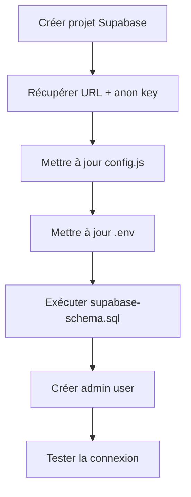

# Configuration Supabase — RESTAURANT FADAE RIF

Ce document répertorie **toute** la configuration Supabase utilisée par le projet RESTAURANT FADAE RIF. Il permet de migrer vers un nouveau compte/projet Supabase sans rien oublier.

---

## 1. Variables d'environnement

### Fichier `js/config.js` (côté client — exposition publique)

```js
export const SUPABASE_URL = 'https://<project-ref>.supabase.co';
export const SUPABASE_ANON_KEY = '<anon-key-public>';
```

### Fichier `.env` (racine du projet — usage local / CI)

```env
# Supabase — FADAE RIF Admin
SUPABASE_URL=https://<project-ref>.supabase.co
SUPABASE_ANON_KEY=<anon-key-public>
SUPABASE_SERVICE_KEY=<service-role-key>       # Ne JAMAIS exposer côté client
SUPABASE_SBP=<personal-access-token>          # PAT pour Management API
```

**Où trouver ces valeurs dans le dashboard Supabase :**

| Variable | Chemin |
|---|---|
| `SUPABASE_URL` | Project Settings → API → Project URL |
| `SUPABASE_ANON_KEY` | Project Settings → API → anon public |
| `SUPABASE_SERVICE_KEY` | Project Settings → API → service_role (secret) |
| `SUPABASE_SBP` | Account → Access Tokens → Generate new token |

### À remplacer pour un nouveau projet

1. Aller dans Supabase Dashboard → New project
2. Copier l'URL et l'anon key depuis **Project Settings → API**
3. Remplacer dans `js/config.js` et `.env`
4. Générer un nouveau PAT dans **Account → Access Tokens** (ou réutiliser un existant)
5. Mettre à jour le `SUPABASE_SERVICE_KEY` et `SUPABASE_SBP` dans `.env`

---

## 2. Authentification

Le projet utilise **Supabase Auth** avec la méthode **Email + Password**.

### Admin user (unique compte)

| Champ | Valeur |
|---|---|
| Email | `admin@fadaerif.ma` |
| Mot de passe | `<your-admin-password>` |

### Création de l'admin user

**Via le dashboard :**
1. Aller dans **Authentication → Users → Add User**
2. Renseigner email + mot de passe
3. Cliquer sur **Create user**

**Via Management API (curl) :**
```bash
curl -X POST https://api.supabase.com/v1/projects/<project-ref>/database/query \
  -H "Authorization: Bearer sbp_<pat>" \
  -H "Content-Type: application/json" \
  -d '{"query": "SELECT supabase_auth.admin_create_user('\''admin@fadaerif.ma'\'', '\''<your-admin-password>'\'');"}'
```

### Connexion côté client

Méthode : `supabase.auth.signInWithPassword({ email, password })`

Déconnexion : `supabase.auth.signOut()`

### Session persistante

Supabase gère automatiquement le refresh token et la persistance de session via `localStorage`. Le code appelle `sup.auth.getSession()` au chargement pour restaurer l'état connecté.

---

## 3. Tables

### Table `categories`

```sql
CREATE TABLE categories (
  id         BIGINT GENERATED ALWAYS AS IDENTITY PRIMARY KEY,
  name       TEXT NOT NULL UNIQUE,
  icon_svg   TEXT DEFAULT '',
  sort_order INT DEFAULT 0
);
```

| Colonne | Type | Contraintes | Usage |
|---|---|---|---|
| `id` | BIGINT (PK) | AUTO-INCREMENT | Identifiant unique |
| `name` | TEXT | NOT NULL, UNIQUE | Nom de la catégorie |
| `icon_svg` | TEXT | DEFAULT '' | SVG inline (plus utilisé dans l'UI, conservé pour compat) |
| `sort_order` | INT | DEFAULT 0 | Ordre d'affichage |

### Table `menu_items`

```sql
CREATE TABLE menu_items (
  id          BIGINT GENERATED ALWAYS AS IDENTITY PRIMARY KEY,
  name        TEXT NOT NULL,
  category    TEXT NOT NULL,
  price       NUMERIC(6,1) NOT NULL,
  description TEXT DEFAULT '',
  tags        TEXT[] DEFAULT '{}',
  available   BOOLEAN DEFAULT TRUE,
  popular     BOOLEAN DEFAULT FALSE,
  image_url   TEXT DEFAULT ''
);
```

| Colonne | Type | Contraintes | Usage |
|---|---|---|---|
| `id` | BIGINT (PK) | AUTO-INCREMENT | Identifiant unique |
| `name` | TEXT | NOT NULL | Nom du plat |
| `category` | TEXT | NOT NULL | Nom de la catégorie (référence) |
| `price` | NUMERIC(6,1) | NOT NULL | Prix en DH |
| `description` | TEXT | DEFAULT '' | Description du plat |
| `tags` | TEXT[] | DEFAULT '{}' | Tags (`chef`, `halal`, `spicy`) |
| `available` | BOOLEAN | DEFAULT TRUE | Disponibilité |
| `popular` | BOOLEAN | DEFAULT FALSE | À la une (featured) |
| `image_url` | TEXT | DEFAULT '' | URL de l'image dans le storage |

### Table `settings` (key-value)

```sql
CREATE TABLE settings (
  key   TEXT PRIMARY KEY,
  value TEXT NOT NULL
);
```

| Colonne | Type | Contraintes | Usage |
|---|---|---|---|
| `key` | TEXT (PK) | NOT NULL | Identifiant de la clé |
| `value` | TEXT | NOT NULL | Valeur associée |

**Clés utilisées par l'application :**

| Key | Valeur par défaut | Usage |
|---|---|---|
| `restaurant_name` | `RESTAURANT FADAE RIF` | Nom dans le header et WhatsApp |
| `restaurant_subtitle` | `Restaurant Gastronomique` | Sous-titre (contact) |
| `address` | Adresse complète | Page contact |
| `hours` | Horaires d'ouverture | Page contact |
| `phone` | `+212 524 43 21 00` | Page contact (formaté) |
| `phone_raw` | `+212524432100` | Lien tel: dans le contact |
| `email` | `contact@fadaerif.ma` | Page contact |
| `instagram` | `@fadaerif.marrakech` | Page contact |
| `wa_number` | `212661234567` | Numéro WhatsApp (sans +) |

---

## 4. Storage bucket

### Bucket `dish-images`

```
Type:     Public
Usage:    Images des plats (menu_items.image_url)
```

### Configuration

```sql
INSERT INTO storage.buckets (id, name, public)
VALUES ('dish-images', 'dish-images', TRUE)
ON CONFLICT (id) DO NOTHING;

CREATE POLICY "Public read"
  ON storage.objects FOR SELECT
  USING (bucket_id = 'dish-images');

CREATE POLICY "Auth upload"
  ON storage.objects FOR INSERT
  WITH CHECK (bucket_id = 'dish-images' AND auth.role() = 'authenticated');

CREATE POLICY "Auth delete"
  ON storage.objects FOR DELETE
  USING (bucket_id = 'dish-images' AND auth.role() = 'authenticated');
```

### Upload depuis le client

- Fonction : `uploadImage(file)` dans `js/supabase.js`
- Redimensionnement : Canvas 800px max-width, format JPEG qualité 80%
- Nom fichier : `{timestamp}-{random}.{ext}`
- SDK : `supabase.storage.from('dish-images').upload(fileName, blob, { contentType: 'image/jpeg' })`

---

## 5. Politiques RLS (Row Level Security)

### Activation

```sql
ALTER TABLE categories ENABLE ROW LEVEL SECURITY;
ALTER TABLE menu_items  ENABLE ROW LEVEL SECURITY;
ALTER TABLE settings   ENABLE ROW LEVEL SECURITY;
```

### Politiques par table

#### `categories` (lecture publique, écriture admin)

| Opération | Politique | Check |
|---|---|---|
| SELECT | `TRUE` (tout le monde peut lire) | — |
| INSERT | `auth.role() = 'authenticated'` | WITH CHECK |
| UPDATE | `auth.role() = 'authenticated'` | USING |
| DELETE | `auth.role() = 'authenticated'` | USING |

#### `menu_items` (lecture publique, écriture admin)

| Opération | Politique | Check |
|---|---|---|
| SELECT | `TRUE` (tout le monde peut lire) | — |
| INSERT | `auth.role() = 'authenticated'` | WITH CHECK |
| UPDATE | `auth.role() = 'authenticated'` | USING |
| DELETE | `auth.role() = 'authenticated'` | USING |

#### `settings` (lecture publique, écriture admin)

| Opération | Politique | Check |
|---|---|---|
| SELECT | `TRUE` (tout le monde peut lire) | — |
| INSERT | `auth.role() = 'authenticated'` | WITH CHECK |
| UPDATE | `auth.role() = 'authenticated'` | USING |
| DELETE | `auth.role() = 'authenticated'` | USING |

---

## 6. Script SQL complet

Le fichier de référence est `supabase-schema.sql` (racine du projet). Il contient :

1. CREATE TABLE pour les 3 tables
2. INSERT du bucket storage
3. CREATE POLICY pour les 3 politiques storage
4. ALTER TABLE … ENABLE ROW LEVEL SECURITY
5. CREATE POLICY pour chaque table et chaque opération
6. INSERT seed data pour `categories`, `menu_items`, `settings`

### Procédure d'exécution

**Option A — SQL Editor dans le dashboard :**
1. Aller dans **SQL Editor → New query**
2. Copier-coller tout le contenu de `supabase-schema.sql`
3. Exécuter

**Option B — Management API (curl, utile pour automatisation) :**
```bash
curl -X POST https://api.supabase.com/v1/projects/<project-ref>/database/query \
  -H "Authorization: Bearer sbp_<your-personal-access-token>" \
  -H "Content-Type: application/json" \
  -d '{"query": "<SQL-escaped>"}'
```

> **Note :** Échapper les guillemets simples dans le SQL en les doublant (`'` → `''`).

---

## 7. Résumé des dépendances SDK

| Bibliothèque | Import | Version |
|---|---|---|
| `@supabase/supabase-js` | `https://esm.sh/@supabase/supabase-js@2` | v2 (latest) |

Le client est créé une seule fois (singleton) :

```js
async function getClient() {
  if (!_supabase) {
    const { createClient } = await import('https://esm.sh/@supabase/supabase-js@2');
    _supabase = createClient(SUPABASE_URL, SUPABASE_ANON_KEY);
  }
  return _supabase;
}
```

---

## 8. API exposée par `js/supabase.js`

### Tables

| Fonction | Table | Opération |
|---|---|---|
| `getCategories()` | `categories` | SELECT * ORDER BY sort_order |
| `addCategory(name, iconSvg, sortOrder)` | `categories` | INSERT |
| `updateCategory(id, updates)` | `categories` | UPDATE WHERE id |
| `deleteCategory(id)` | `categories` | DELETE WHERE id |
| `getMenuItems()` | `menu_items` | SELECT * ORDER BY id |
| `addMenuItem(item)` | `menu_items` | INSERT |
| `updateMenuItem(id, updates)` | `menu_items` | UPDATE WHERE id |
| `deleteMenuItem(id)` | `menu_items` | DELETE WHERE id |
| `getSettings()` | `settings` | SELECT * (retourne map key→value) |
| `upsertSettings(settings)` | `settings` | UPSERT batch (conflit sur `key`) |

### Storage

| Fonction | Opération |
|---|---|
| `uploadImage(file)` | Upload dans `dish-images` (resize 800px) |

### Auth

| Fonction (dans auth.js) | Opération |
|---|---|
| `login(email, password)` | `auth.signInWithPassword()` |

---

## 9. Procédure de migration complète (nouveau projet Supabase)



### Étapes détaillées

1. **Créer un nouveau projet** sur [supabase.com](https://supabase.com)
   - Choisir une région proche de vos utilisateurs (Europe ou Afrique)
   - Noter le mot de passe de la base de données (si demandé)

2. **Récupérer les clés**
   - `Project Settings → API → Project URL` → `SUPABASE_URL`
   - `Project Settings → API → anon public` → `SUPABASE_ANON_KEY`
   - `Project Settings → API → service_role (secret)` → `SUPABASE_SERVICE_KEY`

3. **Générer un Personal Access Token**
   - `Account → Access Tokens → Generate New Token`
   - Copier dans `SUPABASE_SBP` du `.env`

4. **Mettre à jour les fichiers :**
   - `js/config.js` : remplacer `SUPABASE_URL` et `SUPABASE_ANON_KEY`
   - `.env` : remplacer les 4 variables

5. **Exécuter le SQL** (`supabase-schema.sql`)
   - Via **SQL Editor** dans le dashboard
   - Ou via Management API

6. **Créer l'admin user**
   - `Authentication → Users → Add User`
   - Email : `admin@fadaerif.ma` / Password : `<your-admin-password>`

7. **Vérifier** que les tables et le bucket existent
   - `Table Editor` : voir `categories`, `menu_items`, `settings`
   - `Storage` : voir le bucket `dish-images`
   - `Authentication → Users` : voir l'admin user

8. **Tester** l'application
   ```bash
   npx serve luxora --listen 3000
   ```
   - Naviguer dans le menu (vérifier les données seed)
   - Se connecter avec `admin@fadaerif.ma` / `<your-admin-password>`
   - Vérifier le CRUD des plats/catégories
   - Uploader une image de plat
   - Modifier la configuration

---

## 10. Fallback

Si Supabase est injoignable, l'application utilise des **données locales de secours** définies dans `js/menu.js` :

- `FALLBACK_MENU` : 26 plats de démonstration
- `FALLBACK_CATS` : 8 catégories avec SVG inline
- Les settings utilisent des valeurs par défaut dans `renderContact()`

Ces données permettent de visualiser le rendu même sans connexion Supabase.

---

## 11. Informations du projet actuel (à titre de référence)

Ces valeurs sont celles de l'instance Supabase configurée. À remplacer par les vôtres :

| Propriété | Valeur |
|---|---|
| Project ref | `<your-project-ref>` |
| Project URL | `https://<your-project-ref>.supabase.co` |
| Région | `<your-region>` |
| PAT | `<your-personal-access-token>` |
| Anon key | `<your-anon-key>` |
| Service key | `<your-service-role-key>` |
| Admin email | `admin@fadaerif.ma` |
| Admin password | `<your-admin-password>` |
